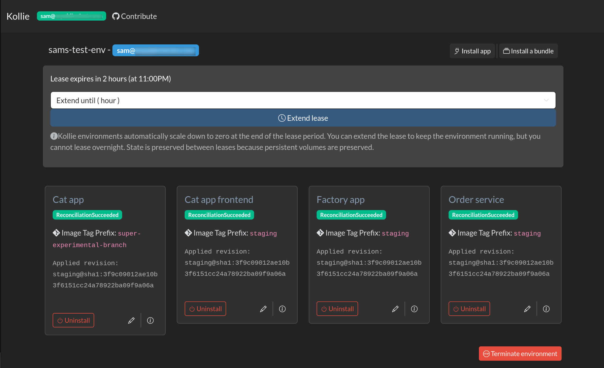
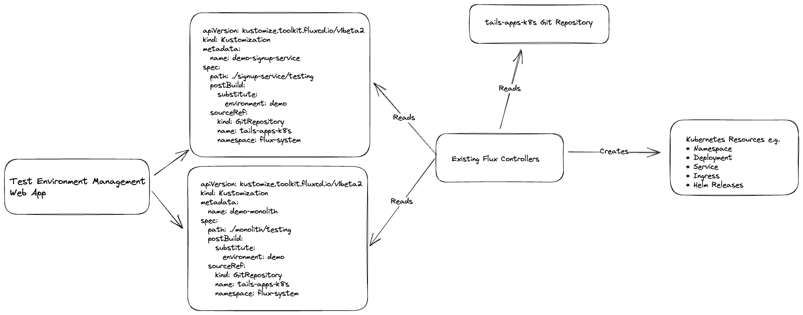

# Kollie

Kollie is a tool for herding your ephemeral test environments on Kubernetes; through deploying and managing test environments deployed using Flux and Helm.

It has its origins as an internal developer tool at Tails.com. We are working on making it useful for a wider audience, but please bear with us while we do things like write better documentation and provide example resources.

## Why should you use it?

The Flux project has fairly recently released the Flux Operator and with it, [the concept of `ResourceSets`](https://fluxcd.control-plane.io/operator/resourcesets/github-pull-requests/). This provides another way to set up ephemeral test environments with Flux. However when managing environments consisting of multiple applications (such as micro-services) from multiple Git repositories it might not fit your needs.

Kollie uses the core `Kustomization` concept within Flux to deploy multiple applications to easily create an environment. These apps might mostly be playing a supporting role in the test environment and be running the stable production or staging version, with only a couple on versions pushed from feature branches. For our needs, we found this approach, combined with an easy to use web-ui provided more flexibility for our developers.

## Core concepts

The core idea of Kollie is to piggyback on a design feature of Flux. Flux is a popular tool for deploying applications to Kubernetes clusters. It works by reading a set of Kubernetes manifests from a Git repository and applying them to the cluster.

One of the key features of Flux is the post build variable substitution built into Flux [Kustomizations](https://fluxcd.io/flux/components/kustomize/kustomization/) (not to be confused with [Kustomize overlays](https://github.com/kubernetes-sigs/kustomize)). Flux's Kustomization Controller give us the ability to "fill in" values for placeholders in a base manifest. Under the hood, Flux creates [Kustomization CRDs](https://fluxcd.io/flux/components/kustomize/kustomization/) in our Kubernetes cluster for every app it knows how to deploy. These CRDs define where the base manifest is (`GitRepository` + location within it) and `postBuild` actions such as environment variable substitution. When Flux reads these CRDs, it applies the substitutions to the base manifests and deploys the app. Exactly how the deployment itself is done is dependent on the service itself but in most cases it is done using Helm via Flux's Helm controller.

Kollie takes advantage of this behaviour of Flux by creating Kustomization CRDs similar to what Flux would do, but configured for test environments.

The following diagram illustrates that concept.

Don't worry if that description of how Kollie works left your head spinning. Most of the magic happens within Flux. Kollie is just a simple tool that creates YAML files inside Kubernetes clusters! That means you can contribute to this project even if you are new to the world of Kubernetes and infrastructure and learn about those technologies along the way!

## Deployment guide

Kollie currently makes quite a few assumptions about your environment and your Flux repository structure. Here is a list of the large ones:
* Your Flux GitRepository resources are all located in the `flux-system` namespace
* Each of your applications has a `ImageRepository` resource on your cluster to allow tracking of new container images. It will need its `accessFrom` attribute configured to allow access from the `kollie` namespace.
* The container images are tagged in the format `<branch name>-<git commit id>-<unix timestamp>`
* The ownership attribution of environments relies on `x-auth-request-email` and `x-auth-request-user` headers being sent in requests from something like oauth2-proxy
* All Kustomizations created by Kollie have an `environment` and a `downscaler_uptime` [substitution](https://fluxcd.io/flux/components/kustomize/kustomizations/#post-build-variable-substitution). The first just contains the environment name, the second provides a time window for when the environment should _not_ be scaled to 0. More in the [Downscaling](#downscaling) section.
* Kustomization labels and annotations are hardcoded to Tails.com conventions
* From version 0.1.0 Kollie requires a minimum of Flux 2.7

In addition the following features still have hardcoding, preventing them from working outside of Tails.com (PRs welcome to fix):
* Custom GitRepository Kubernetes resource creation to allow tracking of a non-default branch

All that said, you can easily deploy Kollie to your cluster using our [Helm Chart](/charts/kollie/README.md).

## Debugging guide

The common things which go wrong with Kollie environments are related to the Flux Custom Resources which Kollie creates. These are the `Kustomization` and the `ImagePolicy` for each app in an environment. These are made in the `kollie` namespace alongside the Kollie application. Check the status of them with `kubectl` to see if there is a problem reconciling the configuration.

The most common issue in this category is the `ImagePolicy` finding no matching image tags. This is usally because there are no images on the registry matching the configured image tag prefix in the format Kollie looks for (`<image_tag_prefix>-<git_commit_id>-<unixtimestamp>`). However it could also be due to a missing `ImageRepository` object or a problem authenticating to the container image registry configured in that `ImageRepository`.

If the `Kustomization` and `ImagePolicy` are fine, it is worth looking at the resources your Kustomizations are creating (as configured in your git repository). It is possible there is some issue with a downstream `HelmRelease` or similar.

## Downscaling

Kollie is designed to be compatible with https://github.com/caas-team/GoKubeDownscaler . One of the Post Build Substitutions provided to the Kustomization resource by default is an uptime window, which can be fed into the namespace annotation required by that controller. When an environment is created it will always have an uptime window until 7pm that day (UTC). It is possible to extend this window from the web interface for that environment if the test environment is needed by the user/developer for longer (or on another subsequent day).

There is also the concept of a lease_exclusion_window for environments you want to run all the time, during a specific window. If an environment name is specified in the `KOLLIE_LEASE_EXCLUSION_LIST` environment variable then the uptime window will always be configured as the hardcoded (for now) value of `Mon-Fri 07:00-19:00 Europe/London`.

## Contributing

Please read [CONTRIBUTING.md](/CONTRIBUTING.md) for details of how to set up a local development environment and how to contribute to the project.
